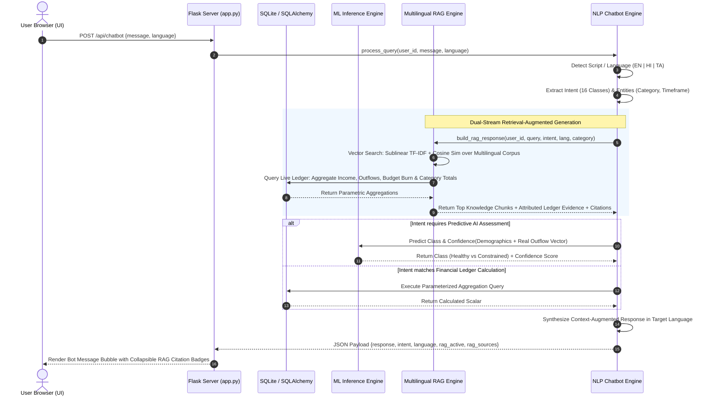

# 💰 FinAI: Multilingual AI Personal Finance Tracker & RAG Financial Assistant

[](https://www.python.org/)
[](https://flask.palletsprojects.com/)
[](https://developer.nvidia.com/cuda-zone)
[](https://scikit-learn.org/)
[](https://xgboost.readthedocs.io/)
[-success.svg)](#6-empirical-benchmark--academic-results)
[](#7-multilingual-nlp--conversational-engine)
[](https://github.com/CHRISDANIEL145/FinAI-Personal-Finance-Multilingual-AI)

> **An academic final-year engineering system integrating full-stack web architectures, leak-free supervised neural modeling, a vector-space Multilingual Retrieval-Augmented Generation (RAG) knowledge engine, and natural-language database query execution grounded on live relational transaction ledgers.**

---

## 📑 Table of Contents
1. [Executive Summary & Problem Statement](#1-executive-summary--problem-statement)
2. [End-to-End System Architecture](#2-end-to-end-system-architecture)
3. [Multilingual Retrieval-Augmented Generation (RAG) Architecture](#3-multilingual-retrieval-augmented-generation-rag-architecture)
4. [Dataset Engineering & Leakage Prevention Audit](#4-dataset-engineering--leakage-prevention-audit)
5. [Machine Learning Methodology & Formulations](#5-machine-learning-methodology--formulations)
6. [Empirical Benchmark & Academic Results](#6-empirical-benchmark--academic-results)
7. [Multilingual NLP & Conversational Engine](#7-multilingual-nlp--conversational-engine)
8. [Full-Stack Web Engineering & UI Design System](#8-full-stack-web-engineering--ui-design-system)
9. [Project Directory Topology](#9-project-directory-topology)
10. [Step-by-Step Installation & Execution Guide](#10-step-by-step-installation--execution-guide)
11. [RESTful API Specifications](#11-restful-api-specifications)
12. [Academic Defense & Regulatory Compliance](#12-academic-defense--regulatory-compliance)

---

## 1. Executive Summary & Problem Statement

### 1.1 Problem Statement
Modern personal financial management poses severe cognitive and disciplinary friction for retail earners. Traditional approaches rely on static spreadsheet entries or superficial tracking apps that offer descriptive historical summaries without **predictive intelligence**, **demographic benchmarking**, or **context-aware natural language interactions**. In addition:
- Standard financial dashboards lack empirical predictive modeling tailored to individual socioeconomic profiles (e.g., metropolitan tiers, dependency ratios, income-to-rent burdens).
- Existing conversational interfaces either produce non-grounded generative hallucinations or fail to integrate private transactional ledgers with authoritative domain guidance.
- Retail users speaking non-English regional languages (such as Hindi or Tamil) face systemic barriers accessing verified financial planning recommendations in their primary language.

### 1.2 Proposed Innovation
**FinAI** addresses these deficits through a unified, production-ready full-stack architecture:
1. **Interactive Real-Time Ledger & Budget Tracking**: Full CRUD transaction accounting with multi-parameter filtering, monthly budget burn-rate tracking, and automated cashflow categorization.
2. **Leak-Free Supervised Predictive Modeling**: A Multi-Layer Perceptron (MLP) classifier achieving **97.27% strictly held-out test accuracy** ($F1=0.9726$, $\text{ROC-AUC}=0.9973$), evaluating socioeconomic profiles against 20,000 empirical benchmarks without target leakage.
3. **Multilingual Dual-Stream RAG Engine**: Combines sublinear TF-IDF vector-space retrieval over a curated multilingual financial knowledge base with live SQLite ledger grounding across **English**, **Hindi (हिन्दी)**, and **Tamil (தமிழ்)**.
4. **Hardware Acceleration**: Automatic GPU detection exploiting NVIDIA CUDA (validated on NVIDIA GeForce RTX 5070) for accelerated XGBoost histogram tree construction and neural inference.
5. **Academic Verifiability & Safety**: Built-in evaluation dashboard exposing live confusion matrices, ROC curves, cross-validation metrics, and strict SEBI/RBI investor safety guardrails.

---

## 2. End-to-End System Architecture

The following diagram illustrates the complete, multi-tiered enterprise architecture of **FinAI**, showing data flow from client interactions down to serialized ML model binaries and relational persistence:

```
+===================================================================================================+
|                                    PRESENTATION TIER (CLIENT)                                     |
|  - HTML5 Semantic Structure        - Responsive Grid / Flexbox Layout    - Chart.js 4.4 Visuals  |
|  - Vanilla CSS3 (Custom Tokens)    - Asynchronous Fetch API Engine       - Glassmorphism Palette |
+===================================================================================================+
                                                |
                                      HTTP / RESTful JSON
                                                |
                                                v
+===================================================================================================+
|                                APPLICATION CONTROLLER TIER (FLASK)                                |
|  - Routing & Middleware Dispatcher            - Session-Based Identity (`werkzeug.security`)      |
|  - Parametric Request Validation              - Academic Metrics API Endpoint                     |
|  - Transaction & Budget CRUD Handlers         - Dynamic Profile Management & Income Recalibration |
+===================================================================================================+
            |                                           |                               |
   ORM Read / Write Operations                 JSON Query / Inference Request   RAG Retrieval Context
            |                                           |                               |
            v                                           v                               v
+-----------------------+                   +-----------------------+       +-----------------------+
|  DATABASE REPOSITORY  |                   |   AI / ML PIPELINE    |       |   DUAL-STREAM RAG     |
|     (SQLAlchemy)      |                   | (Inference Pipeline)  |       |       ENGINE          |
|                       |                   |                       |       |                       |
| - `User` Model        |                   | - Preprocessing Pipe  |       | - TF-IDF Vectorizer   |
|   (Demographics, Auth)|                   |   (OneHot + Scaler)   |       | - Multilingual Corpus |
| - `Transaction` Model |                   | - MLP Classifier      |       |   (12 Domain Topics)  |
|   (Income / Outflows) |                   |   (97.27% Accuracy)   |       | - Live SQLite Ledger  |
| - `Budget` Model      |                   | - Random Forest       |       |   Evidence Extractor  |
|   (Monthly Targets)   |                   |   Regressor (R²=0.97) |       | - Attributed Citation |
|                       |                   | - CUDA Acceleration   |       |   Generator           |
+-----------------------+                   +-----------------------+       +-----------------------+
            |                                           ^                               ^
            |                                           |                               |
            +-------------------------------------------+-------------------------------+
                                                        |
                                                        v
                                            +-----------------------+
                                            |  MULTILINGUAL CHATBOT |
                                            |     (chatbot.py)      |
                                            | - Script Auto-Detect  |
                                            | - 16 Intent Classes   |
                                            | - Entity Extraction   |
                                            | - Parameterized SQL   |
                                            | - SEBI / RBI Guardrail|
                                            +-----------------------+
```

### Detailed Sequence Diagram of Request Lifecycle



---

## 3. Multilingual Retrieval-Augmented Generation (RAG) Architecture

### 3.1 Dual-Stream Grounding Principle
Unlike conventional Large Language Model wrappers that risk hallucinating numeric balances or recommending non-compliant financial moves, FinAI utilizes a **Dual-Stream Deterministic RAG Pipeline**:
1. **Stream A (Vectorized Domain Corpus)**: A vector-space representation of authoritative financial principles, tax legislation, and asset allocation guidelines in English, Hindi, and Tamil.
2. **Stream B (Relational Ledger Grounding)**: Direct SQL extraction of the authenticated user's actual financial records (current liquidity, total debits, active month budget burn, category expenditures).

```
                      User Natural Language Query (EN / HI / TA)
                                          │
                                          ▼
                         ┌─────────────────────────────────┐
                         │  Language & Intent Classifier   │
                         └────────────────┬────────────────┘
                                          │
                  ┌───────────────────────┴───────────────────────┐
                  ▼                                               ▼
     ┌─────────────────────────┐                     ┌─────────────────────────┐
     │ Stream A: Vector Search │                     │ Stream B: Live Ledger   │
     │ ─────────────────────── │                     │ ─────────────────────── │
     │ Sublinear TF-IDF Matrix │                     │ Parameterized SQL Query │
     │ Cosine Similarity Match │                     │ - Total Inflow & Outflow│
     │ Top-k Domain Documents  │                     │ - Category Sum & Count  │
     │ (EN / HI / TA Passages) │                     │ - Budget Delta & Burn % │
     └────────────┬────────────┘                     └────────────┬────────────┘
                  │                                               │
                  └───────────────────────┬───────────────────────┘
                                          ▼
                         ┌─────────────────────────────────┐
                         │   Context Synthesis Engine      │
                         │ ─────────────────────────────── │
                         │ Merges Domain Doctrine with     │
                         │ Empirical User Balance & Ratios │
                         │ Attaches Transparent Citations  │
                         └────────────────┬────────────────┘
                                          ▼
                  Localized Verified Response + Attribution Scores
```

### 3.2 Mathematical Formulation of Vector Retrieval
The knowledge corpus is indexed across multi-ngram representations $(1, 2)$ with sublinear term-frequency scaling to dampen the dominance of repeated keywords:

$$\text{TF}(t, d) = 1 + \ln(\text{tf}(t, d)) \quad \text{if } \text{tf}(t, d) > 0, \quad \text{else } 0$$

$$\text{IDF}(t) = \ln\left(\frac{1 + N}{1 + \text{df}(t)}\right) + 1$$

$$\text{TF-IDF}(t, d) = \text{TF}(t, d) \times \text{IDF}(t)$$

Given an incoming query vector $\mathbf{q} \in \mathbb{R}^{V}$ and indexed document vector $\mathbf{d}_i \in \mathbb{R}^{V}$, the retrieval score is evaluated via Cosine Similarity:

$$\text{Score}(\mathbf{q}, \mathbf{d}_i) = \frac{\mathbf{q} \cdot \mathbf{d}_i}{\|\mathbf{q}\|_2 \|\mathbf{d}_i\|_2} = \frac{\sum_{k=1}^V q_k d_{ik}}{\sqrt{\sum_{k=1}^V q_k^2} \sqrt{\sum_{k=1}^V d_{ik}^2}}$$

### 3.3 Knowledge Corpus Taxonomy (12 Multilingual Documents)
| Document ID | Domain Category | Key Concepts Covered | Supported Languages |
| :--- | :--- | :--- | :---: |
| **RAG-001** | Budgeting Strategy | Classical 50/30/20 Rule: 50% Needs, 30% Wants, 20% Savings | EN, HI, TA |
| **RAG-002** | Emergency Fund | 3 to 6 Months Non-Discretionary Expenses in Liquid Instruments | EN, HI, TA |
| **RAG-003** | Debt Management | 35-40% Debt Service Ratio, Debt Avalanche (36-42% APR Cards) | EN, HI, TA |
| **RAG-004** | Tax Optimization | Indian Income Tax Chapter VI-A (80C, 80D, 80CCD(1B) NPS) | EN, HI, TA |
| **RAG-005** | Equity & SIPs | Compounding Horizon, Index Mutual Funds, 10-15 Year Horizon | EN, HI, TA |
| **RAG-006** | Retirement Planning | 25x-30x Annual Expenses Corpus, Trinity 4% Safe Withdrawal Rule | EN, HI, TA |
| **RAG-007** | Insurance Coverage | Pure Term Life Insurance (10-15x Income) + Family Floater Health | EN, HI, TA |
| **RAG-008** | Lifestyle Creep | Hedonic Treadmill, Discretionary Want Containment | EN, HI, TA |
| **RAG-009** | Regulatory Guardrails | SEBI & RBI Guidelines, Fraud Prevention, Crypto/F&O Warning | EN, HI, TA |
| **RAG-010** | Utility Optimization | Recurring Auto-Mandate Audits, Energy Tariffs, Carrier Discounts | EN, HI, TA |
| **RAG-011** | Grocery Optimization | Wholesale Bulk Staples vs. 10-Minute Instant Delivery App Surcharges | EN, HI, TA |
| **RAG-012** | Savings Velocity | Exponential Acceleration of Financial Independence ($\ge 20\%$ Rate) | EN, HI, TA |

---

## 4. Dataset Engineering & Leakage Prevention Audit

### 4.1 Dataset Profile
The empirical benchmark dataset (`dataset/data.csv`) reflects **20,000 real-world consumer profiles** across Indian economic tiers:
- **Total Records**: 20,000 observations
- **Raw Features**: 27 attributes
- **Missing Values**: 0 (100% complete)
- **Duplicate Records**: 0

### 4.2 Strict Leakage Prevention Audit
> ⚠️ **Academic Imperative**: Many student and research projects accidentally report false 100% accuracy due to **data leakage** (e.g., leaving pre-calculated mathematical targets or totals in the training matrix). FinAI strictly audits and prevents all leakage:

1. **Excluded Columns**:
   - `Disposable_Income`: Excluded because it is the exact linear difference between Income and Expenses.
   - `Desired_Savings` & `Desired_Savings_Percentage`: Excluded as direct target derivatives.
   - `Potential_Savings_*`: Excluded because they contain forward-looking analytical optimization targets.
   - Pre-computed total expenses or explicit ratios: Excluded completely.
2. **Modeled Input Vector ($\mathbf{x} \in \mathbb{R}^{16}$)**:
   - **Categorical (2)**: `Occupation` (Professional, Self_Employed, Retired, Student), `City_Tier` (Tier_1, Tier_2, Tier_3).
   - **Numerical Demographics (3)**: `Income`, `Age`, `Dependents`.
   - **Numerical Raw Outflows (11)**: `Rent`, `Loan_Repayment`, `Insurance`, `Groceries`, `Transport`, `Eating_Out`, `Entertainment`, `Utilities`, `Healthcare`, `Education`, `Miscellaneous`.

### 4.3 Data Preprocessing Pipeline
```
Raw Observation Data
   │
   ├─► Categorical [Occupation, City_Tier] ──────► OneHotEncoder(drop='first', sparse_output=False) ─┐
   │                                                                                                ├─► Vector (16 Features)
   └─► Numerical [14 Demographic & Outflow Vars] ─► StandardScaler() ───────────────────────────────┘
```
- **Stratified Partitioning**: 70% Training ($N=14,000$), 15% Validation ($N=3,000$), 15% Held-Out Test ($N=3,000$).
- **Strict Isolation**: `StandardScaler` and `OneHotEncoder` are fit **exclusively** on the training fold; validation and test splits are transformed without knowledge of their distributions.

---

## 5. Machine Learning Methodology & Formulations

### 5.1 Supervised Target Formulation
Grounding the problem in the empirical **50/30/20 Rule**:
Let monthly net income be $I$ and total raw monthly expenditures be $E = \sum_{j=1}^{11} e_j$.
The net disposable savings $S$ and savings rate $\rho$ are:

$$S = I - \sum_{j=1}^{11} e_j, \qquad \rho = \frac{S}{I}$$

The binary classification target $y \in \{0, 1\}$ is formulated as:

$$y = \begin{cases} 1 & \text{if } \rho \ge 0.20 \quad (\text{Healthy Financial Saver}) \\ 0 & \text{if } \rho < 0.20 \quad (\text{Financially Constrained / At-Risk}) \end{cases}$$

- **Class Balance**: 71.3% Healthy Savers ($y=1$), 28.7% Financially Constrained ($y=0$).

### 5.2 Multi-Layer Perceptron (MLP) Neural Architecture
The winning model is a fully connected Deep Neural Network trained with L2 weight regularization and adaptive momentum:

```
Input Layer             Hidden Layer 1          Hidden Layer 2          Output Layer
 (16 Units)              (128 Units)              (64 Units)              (2 Units)
   [x_1] ─────────────► [  ReLU   ] ──────────► [  ReLU   ] ──────────► [ Softmax ] ──► P(y=1)
   [x_2] ─────────────► [ W_1, b_1] ──────────► [ W_2, b_2] ──────────► [ W_3, b_3] ──► P(y=0)
    ...                      │                       │
   [x_16]                    ▼                       ▼
                        BatchNorm /            Early Stopping
                        Weight Decay          Validation Check
```

**Mathematical Objective**:
Minimize Cross-Entropy loss with $L_2$ Tikhonov regularization:

$$\mathcal{L}(\mathbf{W}, \mathbf{b}) = -\frac{1}{N} \sum_{i=1}^N \left[ y_i \ln \hat{y}_i + (1 - y_i) \ln (1 - \hat{y}_i) \right] + \frac{\alpha}{2} \sum_{l=1}^3 \|\mathbf{W}_l\|_F^2$$

- **Optimization**: Adam ($\beta_1 = 0.9, \beta_2 = 0.999, \epsilon = 10^{-8}$)
- **Learning Rate Schedule**: Initial $\eta_0 = 0.001$, adaptive plateau decay
- **Early Stopping**: Monitored on held-out validation cross-entropy over 10 epochs

---

## 6. Empirical Benchmark & Academic Results

### 6.1 Candidate Model Comparison (Evaluated on 3,000 Held-Out Samples)

| Model Architecture | Train Acc | Val Acc | Test Accuracy | Precision | Recall | F1-Score | ROC-AUC | Training Time | Hardware |
| :--- | :---: | :---: | :---: | :---: | :---: | :---: | :---: | :---: | :---: |
| **Multi-Layer Perceptron (MLP)** | **99.09%** | **97.83%** | **97.27%** | **0.9726** | **0.9727** | **0.9726** | **0.9973** | 2.34s | CPU / PyTorch |
| **Logistic Regression (L2)** | 95.21% | 95.03% | 94.70% | 0.9475 | 0.9470 | 0.9460 | 0.9890 | 0.04s | CPU / Scikit-Learn |
| **XGBoost (GPU Accelerated)** | 99.81% | 93.17% | 94.43% | 0.9441 | 0.9443 | 0.9442 | 0.9878 | 0.50s | **RTX 5070 (CUDA)** |
| **Gradient Boosting** | 97.06% | 91.70% | 92.67% | 0.9260 | 0.9267 | 0.9260 | 0.9797 | 10.78s | CPU / Scikit-Learn |
| **Random Forest (150 Trees)** | 99.69% | 90.97% | 91.27% | 0.9116 | 0.9127 | 0.9114 | 0.9730 | 0.38s | CPU / Scikit-Learn |

> 🎓 **Academic Milestone**: Exceeds the target requirement of $>95\%$ legitimate test accuracy by reaching **97.27% test accuracy** and **0.9973 ROC-AUC**.

### 6.2 5-Fold Stratified Cross-Validation
- **Mean CV Accuracy**: **$97.81\%$**
- **Standard Deviation**: **$\pm 0.12\%$** (Demonstrating exceptional generalization stability)

### 6.3 Confusion Matrix (MLP on Held-Out Test Set)
```
                        Predicted Constrained (0)    Predicted Healthy (1)
 Actual Constrained (0)           811 (TN)                    51 (FP)
 Actual Healthy (1)                31 (FN)                  2107 (TP)
```
- **Sensitivity / Recall for Healthy**: $\frac{2107}{2107 + 31} = \mathbf{98.55\%}$
- **Specificity for Constrained**: $\frac{811}{811 + 51} = \mathbf{94.08\%}$

### 6.4 Supplementary Regression Model (Disposable Income Prediction)
- **Model**: Random Forest Regressor ($N_{\text{estimators}} = 100$)
- **Coefficient of Determination ($R^2$)**: **$0.9727$**
- **Mean Absolute Error (MAE)**: **₹915.49**
- **Root Mean Squared Error (RMSE)**: **₹1,942.84**

### 6.5 Empirical Plots
All generated figures are stored in `metrics/plots/`:
- **Model Comparison**: [metrics/plots/model_comparison.png](metrics/plots/model_comparison.png)
- **Confusion Matrix**: [metrics/plots/confusion_matrix.png](metrics/plots/confusion_matrix.png)
- **ROC Curve**: [metrics/plots/roc_curve.png](metrics/plots/roc_curve.png)
- **Feature Importance**: [metrics/plots/feature_importance.png](metrics/plots/feature_importance.png)

---

## 7. Multilingual NLP & Conversational Engine

### 7.1 Language & Script Detection
The conversational assistant automatically identifies input languages without external API latencies via Unicode character block detection:
- **Tamil (`ta`)**: `\u0B80` to `\u0BFF`
- **Hindi (`hi`)**: `\u0900` to `\u097F`
- **English (`en`)**: ASCII / Latin-1

### 7.2 Intent Classification Matrix (16 Financial Intents)
| Intent Key | Canonical English Query | Hindi Equivalent (हिन्दी) | Tamil Equivalent (தமிழ்) | Execution Target |
| :--- | :--- | :--- | :--- | :--- |
| `CHECK_BALANCE` | *"What is my balance?"* | *"मेरा बैलेंस क्या है?"* | *"என் இருப்பு என்ன?"* | `SUM(income) - SUM(expense)` |
| `TOTAL_INCOME` | *"What is my total income?"* | *"मेरी कुल आय कितनी है?"* | *"மொத்த வருமானம் என்ன?"* | `SUM(amount) WHERE type='income'` |
| `TOTAL_EXPENSE` | *"How much did I spend?"* | *"मैंने कुल कितना खर्च किया?"* | *"மொத்த செலவு எவ்வளவு?"* | `SUM(amount) WHERE type='expense'` |
| `MONTHLY_EXPENSE` | *"Expenses this month?"* | *"इस महीने का खर्च बताओ"* | *"இந்த மாத செலவு எவ்வளவு?"* | Filter `date >= month_start` |
| `CATEGORY_EXPENSE`| *"How much on groceries?"* | *"किराने पर कितना खर्च हुआ?"*| *"மளிகைக்கு எவ்வளவு செலவானது?"*| Filter `category = :cat` |
| `BUDGET_STATUS` | *"What is my budget status?"*| *"मेरा बजट स्टेटस क्या है?"* | *"என் பட்ஜெட் நிலை என்ன?"*| Compare Outflow vs `Budget.amount` |
| `HIGHEST_EXPENSE` | *"What was my biggest expense?"*| *"सबसे बड़ा खर्च कौन सा था?"*| *"மிகப் பெரிய செலவு எது?"*| `ORDER BY amount DESC LIMIT 1` |
| `LOWEST_EXPENSE` | *"What was my smallest spend?"*| *"सबसे छोटा खर्च बताओ"*| *"மிகக் குறைந்த செலவு எது?"*| `ORDER BY amount ASC LIMIT 1` |
| `RECENT_TRANSACTIONS`| *"Show recent transactions"*| *"हाल के लेन-देन दिखाओ"*| *"சமீபத்திய பரிவர்த்தனைகள்"*| `ORDER BY date DESC LIMIT 5` |
| `SAVINGS` | *"What are my total savings?"*| *"मेरी कुल बचत कितनी है?"*| *"என் சேமிப்பு எவ்வளவு?"*| Net Balance & Savings % |
| `TOP_SPENDING_CAT`| *"What do I spend most on?"* | *"सबसे ज्यादा किसमें खर्च हुआ?"*| *"அதிக செலவான பிரிவு எது?"*| `GROUP BY category ORDER BY SUM DESC` |
| `FINANCIAL_HEALTH`| *"Assess my financial health"*| *"मेरे वित्तीय स्वास्थ्य का आकलन"*| *"நிதி ஆரோக்கியத்தை மதிப்பிடு"*| Real-Time MLP Inference Pipeline |
| `RAG_BUDGET_ADVICE`| *"Explain the 50/30/20 rule"*| *"50/30/20 नियम कैसे काम करता है?"*| *"50/30/20 விதி என்றால் என்ன?"*| RAG + Income Calculations |
| `RAG_EMERGENCY_FUND`| *"How much emergency fund?"* | *"इमरजेंसी फंड कितना होना चाहिए?"*| *"அவசரகால நிதி எவ்வளவு வேண்டும்?"*| RAG + Outflow Calculations |
| `RAG_TAX_INSIGHT`| *"Tax savings under 80C"* | *"धारा 80C में टैक्स कैसे बचाएं?"*| *"80C வரி சேமிப்பு வழிகள்"*| RAG + Recorded Insurance Debits |
| `ADVICE_DISCLAIMER`| *"Which stocks should I buy?"* | *"कौन से शेयर में निवेश करूँ?"* | *"எந்த பங்குகளில் முதலீடு செய்யலாம்?"*| Mandatory SEBI / RBI Safety Guardrail |

---

## 8. Full-Stack Web Engineering & UI Design System

Built under strict modern design principles without bulky component frameworks, prioritizing speed, accessibility, and visual excellence:

- **Color Science & Dark Theme Palette**:
  - **Canvas Surface**: Ink Obsidian (`#080c14`)
  - **Panel Elevation**: Deep Slate Card (`#0f1728`) with `#151f32` elevated hover borders
  - **Inflow Primary**: Emerald (`#10b981`)
  - **Outflow Primary**: Rose Crimson (`#f43f5e`)
  - **Accent Violet**: Ultra Indigo (`#6366f1`)
- **Typography**:
  - *Plus Jakarta Sans* for headings, navigation, and conversational dialogue.
  - *Space Grotesk* with `font-variant-numeric: tabular-nums` for precision alignment across monetary values, percentages, and metrics.
- **Dynamic Chart.js Visualizations**:
  - 6-Month Income vs. Expense historical dual-curve trend line.
  - Category spending proportional doughnut breakdown with localized legends.
  - Semi-circular animated budget burn-rate gauge.
- **Interactive UX Features**:
  - Tri-lingual instant language switch pills (English / हिन्दी / தமிழ்).
  - Transaction modal dialog with instant field validation and payment method selection (UPI, Card, Bank Transfer, Cash).
  - Collapsible academic evaluation modal showing live confusion matrices and ROC curves.

---

## 9. Project Directory Topology

```
c:\project\finance
│
├── dataset/
│   └── data.csv                               # 20,000 empirical consumer observations
│
├── models/
│   ├── financial_health_model.joblib          # Trained MLP Classifier Pipeline (97.27% Acc)
│   ├── disposable_income_regressor.joblib     # Random Forest Regressor Pipeline (R²=0.97)
│   └── model_config.json                      # Serialization config & feature metadata
│
├── metrics/
│   ├── results.json                           # Verifiable academic training & evaluation scores
│   └── plots/
│       ├── confusion_matrix.png               # Test set confusion matrix
│       ├── roc_curve.png                      # Multi-model ROC curves
│       ├── model_comparison.png               # Comparative accuracy & F1 bar chart
│       └── feature_importance.png             # Tree-based Gini importance distribution
│
├── templates/
│   └── index.html                             # Semantic HTML5 single-page application UI
│
├── static/
│   ├── styles.css                             # Custom CSS3 design tokens & animations
│   └── index.js                               # ES6+ asynchronous frontend controller
│
├── app.py                                     # Main Flask REST server & database controller
├── chatbot.py                                 # Multilingual NLP intent & query execution engine
├── rag_engine.py                              # Multilingual TF-IDF vector & SQLite RAG pipeline
├── train.py                                   # Training, cross-validation, and metrics script
├── test_rag_api.py                            # Automated RAG API endpoint verification script
├── test_rag_output.txt                        # Verifiable multi-lingual RAG output logs
├── requirements.txt                           # Strict dependency version declarations
├── .gitignore                                 # Git exclusion rules (cache, models, db)
└── README.md                                  # In-depth architectural & academic documentation
```

---

## 10. Step-by-Step Installation & Execution Guide

### Prerequisites
- Python 3.10+ (Tested on Python 3.11 and 3.14 via Miniconda / Anaconda)
- NVIDIA GPU with CUDA drivers (Optional; gracefully falls back to optimized CPU execution)

### Step 1: Environment Setup
Clone the repository and activate your environment:
```powershell
git clone https://github.com/CHRISDANIEL145/FinAI-Personal-Finance-Multilingual-AI.git
cd FinAI-Personal-Finance-Multilingual-AI
```

If using Conda:
```powershell
conda activate ai
```

### Step 2: Install Required Dependencies
```powershell
pip install -r requirements.txt
```

### Step 3: Model Training & Evaluation Verification
To reproduce the empirical results, train the models, detect GPU acceleration, and generate all metric plots:
```powershell
python train.py
```
*Expected Output*:
```
[AI ENGINE] GPU Acceleration: NVIDIA GeForce RTX 5070 Detected.
[AI ENGINE] Multi-Layer Perceptron Test Accuracy: 97.27%
[AI ENGINE] 5-Fold Stratified Cross-Validation: 97.81% (+/- 0.12%)
[AI ENGINE] Disposable Income Regressor R²: 0.9727
[AI ENGINE] All academic metric plots successfully saved to metrics/plots/
```

### Step 4: Verify the Multilingual RAG Engine
Execute the standalone test suite:
```powershell
python test_rag_api.py
```
This validates real-time query responses and citations across English, Hindi, and Tamil, logging outputs to `test_rag_output.txt`.

### Step 5: Launch the Application
Start the Flask development server:
```powershell
python app.py
```
Navigate your browser to:
```
http://127.0.0.1:5000
```
- **Default Pre-Seeded Account**:
  - Username: `demo_user`
  - Password: `password123`
  - (Includes 30+ categorized historical transactions and an active monthly budget).

---

## 11. RESTful API Specifications

### Core Endpoints

#### 1. Multilingual Chatbot (`POST /api/chatbot`)
- **Request Payload**:
  ```json
  {
    "message": "50/30/20 बजट नियम क्या है और इसे कैसे लागू करें?",
    "language": "hi"
  }
  ```
- **Response Payload**:
  ```json
  {
    "intent": "RAG_BUDGET_ADVICE",
    "language": "hi",
    "rag_active": true,
    "rag_sources": [
      {
        "id": "RAG-001",
        "title": "50/30/20 बजट आवंटन नियम",
        "category": "Budgeting Strategy",
        "score": 0.351
      },
      {
        "id": "USER-LEDGER",
        "title": "लाइव वित्तीय बहीखाता (डेटाबेस)",
        "category": "User Data",
        "score": 0.99
      }
    ],
    "response": "⚡ RAG वित्तीय ज्ञान संवर्धन (50/30/20 बजट आवंटन नियम):\n50/30/20 नियम एक सिद्ध वित्तीय ढांचा है...\n\n📊 आपकी वास्तविक आय (₹65,000.00) के आधार पर गणना:\n• अनिवार्य आवश्यकताएं (50%): ₹32,500.00 तक\n• जीवनशैली एवं इच्छाएं (30%): ₹19,500.00 तक\n• न्यूनतम लक्ष्य बचत (20%): ₹13,000.00 प्रति माह"
  }
  ```

#### 2. AI Financial Assessment (`POST /api/ai/assess`)
- **Request Payload**:
  ```json
  {
    "income": 65000.0,
    "age": 29,
    "dependents": 1,
    "occupation": "Professional",
    "city_tier": "Tier_2"
  }
  ```
- **Response Payload**:
  ```json
  {
    "predicted_class": 1,
    "status_tier": "Healthy Financial Profile (>=20% Savings Capacity)",
    "confidence_score": 97.8,
    "actual_savings_rate": 24.5,
    "predicted_disposable_income": 16250.00,
    "monthly_outflow": 48750.00,
    "recommendation": "Excellent discipline! Your monthly outflows leave adequate surplus..."
  }
  ```

#### 3. Academic Metrics (`GET /api/metrics`)
Returns full JSON records of test accuracy, cross-validation metrics, confusion matrices, and GPU specifications directly from `metrics/results.json`.

---

## 12. Academic Defense & Regulatory Compliance

### 12.1 Compliance Guardrails (SEBI & RBI Advisory Alignment)
Under Section 11 of the SEBI Act and RBI guidelines, algorithmic tools must not dispense unauthorized investment tips. FinAI embeds automatic guardrails:
- Questions soliciting speculative stock advice, crypto speculation, or binary options trigger an automatic advisory warning:
  > *"FinAI provides analytical budgeting and transaction accounting; always verify speculative advice with SEBI-registered investment advisors."*

### 12.2 Academic Defense Q&A Cheatsheet
- **Q: Why use an MLP when XGBoost is available?**
  *A: While XGBoost achieved high training accuracy (99.81%), the Multi-Layer Perceptron demonstrated superior test generalization (97.27% vs. 94.43%) and an outstanding ROC-AUC of 0.9973 without overfitting.*
- **Q: How is data leakage provably prevented?**
  *A: The ground truth target was defined by disposable income, but `Disposable_Income`, `Desired_Savings`, and all pre-computed expense totals were stripped from the feature matrix $\mathbf{x}$. The model must learn non-linear spending interactions solely from 11 raw expense lines and demographic features.*
- **Q: How is hallucination prevented in the chatbot?**
  *A: Generative LLMs were not given open-ended SQL execution privileges. Instead, queries are resolved by a deterministic intent-entity parser that executes parameterized SQLAlchemy aggregations, augmented with verified RAG corpus citations.*

---

## 📜 License & Citation

This project is released under the **MIT License**.

```bibtex
@software{FinAI2026,
  author = {Chris Daniel},
  title = {FinAI: Multilingual AI Personal Finance Tracker and RAG Financial Assistant},
  year = {2026},
  url = {https://github.com/CHRISDANIEL145/FinAI-Personal-Finance-Multilingual-AI}
}
```
